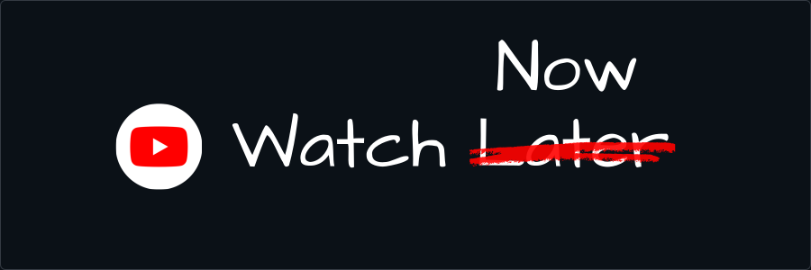

<p align="center">
  
</p>

# Watch Now

A Chrome Extension that turns your YouTube Watch Later playlist into a fast, searchable, filterable video grid — right inside the browser popup.


## Features

| Feature | Description |
|---|---|
| **Full playlist scan** | Scrolls and scrapes every video in your Watch Later, even with 600–2000+ videos |
| **Searchable grid** | Instantly filter videos by title or channel name |
| **Sort options** | Sort by Newest, Oldest, or Shuffle |
| **Watched detection** | Videos you've started are automatically detected and dimmed |
| **Unwatched counter** | See how many unstarted videos are in your queue at a glance |
| **Filter toggle** | Switch between All videos and Unwatched-only |
| **Surprise Me** | Opens a random video — respects your active search and filter |
| **Rescan** | Re-scan at any time to pick up newly added videos |
| **One-click open** | Clicking any card opens the video in a new tab |

---

## Installation

This extension is not on the Chrome Web Store. Install it manually in developer mode.

**Step 1 — Download the extension**

Clone this repository or download it as a ZIP and unzip it.

```
git clone https://github.com/bharadwaja1557/watch-now-extension.git
```

**Step 2 — Open Chrome Extensions**

Navigate to:

```
chrome://extensions
```

**Step 3 — Enable Developer Mode**

Toggle the **Developer mode** switch in the top-right corner of the page.

**Step 4 — Load the extension**

Click **Load unpacked** and select the `watch-now-extension` folder (the one containing `manifest.json`).

The Watch Now icon will appear in your Chrome toolbar.

---

## How to Use

**1. Open your Watch Later playlist**

Go to [youtube.com/playlist?list=WL](https://www.youtube.com/playlist?list=WL) and leave that tab open.

**2. Click the Watch Now extension icon**

The popup opens and immediately begins scanning. You'll see a live counter as videos are discovered:

```
Scanning your playlist…
1557 videos found
```
Keep the Watch Later tab open while scanning.

**3. Browse your videos**

Once scanning completes, your full playlist appears as a 2-column grid. From here you can:

- **Search** — type in the search bar to filter by title or channel
- **Sort** — choose New (default), Old, or Shuffle from the dropdown
- **Filter** — toggle between All and Unwatched
- **Surprise Me** — let the extension pick something for you
- **Click any card** — opens that video in a new tab

**4. Rescan**

If you've added new videos to your playlist, click **↺ Rescan** to run a fresh scan.

---

## How It Works

Watch Now uses no external APIs. All data comes from the YouTube page itself.

### Scraping

The content script (`content.js`) runs on your Watch Later tab and scrolls the page using:

```js
window.scrollTo({ top: document.documentElement.scrollHeight, behavior: "instant" });
```

The important part -- scrolling `window` is what triggers YouTube's lazy loader to fetch the next batch of videos over the network. Scrolling an inner container does not.

After each scroll, the script waits 1200ms for YouTube to load and render new video nodes, then sweeps all `ytd-playlist-video-renderer` elements into a `Map` keyed by video ID. The Map provides automatic deduplication.

### Termination

The scraper stops when one of three conditions is met:

1. **Stable count** — 5 consecutive scrolls produce no new videos
2. **Declared total matched** — YouTube's sidebar shows a total count (e.g. "174 videos") and the scraper has found that many
3. **Safety cap** — a hard limit of 200 scroll attempts, preventing any infinite loop

### Watched Detection

YouTube renders a `ytd-thumbnail-overlay-resume-playback-renderer` element (the red progress bar) inside any video renderer where the user has started watching. The scraper checks for this element on each node:

```js
const watched = node.querySelector("ytd-thumbnail-overlay-resume-playback-renderer") !== null;
```

### Storage

Results are written to `chrome.storage.local` as a flat array of video objects. The popup polls storage every 500ms during a scan to show live progress, then reads the completed array once scanning finishes.

```js
// Video object shape
{
  videoId:   string,   // YouTube video ID
  title:     string,
  channel:   string,
  duration:  string,   // e.g. "12:34"
  thumbnail: string,   // mqdefault.jpg URL
  videoUrl:  string,   // full watch URL
  watched:   boolean   // true if resume overlay detected
}
```

### Render Pipeline

The popup applies transformations in a fixed order, none of which mutate the original array:

```
allVideos → applyFilter() → applySearch() → applySort() → renderGrid()
```

This means all three controls — filter, search, and sort — compose correctly with each other. Surprise Me also runs through `applyFilter → applySearch` so it only picks from what's currently visible on screen.

---

## File Structure

```
watch-now-extension/
├── manifest.json       Extension manifest (Manifest V3)
├── background.js       Service worker — message routing between popup and content script
├── content.js          Scraper — runs on the Watch Later tab, scrolls and collects videos
├── popup.html          Popup markup — 3-row header + 4 view states
├── popup.js            Popup logic — filtering, sorting, rendering, polling
├── styles.css          All styles — dark YouTube-inspired theme
└── icons/
    ├── icon16.png
    ├── icon48.png
    └── icon128.png
```

---

## Permissions Used

| Permission | Why it's needed |
|---|---|
| `storage` | Save scraped video data and scrape status to `chrome.storage.local` |
| `tabs` | Find the open Watch Later tab; open videos in new tabs |
| `scripting` | Inject the content script into the Watch Later tab on demand |
| `host_permissions: youtube.com` | Allow the content script to run on YouTube pages |

---

## Known Limitations

- **Watched status accuracy** — The `watched` flag reflects YouTube's resume-playback overlay, which appears when a video has been *started but not necessarily finished*. A video watched to completion may lose its overlay and appear as unwatched after a while.
- **Scan time** — Large playlists (1000+ videos) take several minutes because the scraper must wait for YouTube to load each batch over the network. This is intentional — it prevents triggering YouTube's rate limits.
- **Static snapshot** — Scanned data is a snapshot. Newly added videos won't appear until you click Rescan.
- **Watch Later only** — The extension is scoped to the Watch Later playlist (`list=WL`) only.

---

## Tech Stack

- **Manifest V3** Chrome Extension APIs
- Vanilla JavaScript (no frameworks, no build step)
- CSS custom properties for theming
- `chrome.storage.local` for persistence
- DOM scraping via `querySelectorAll` on YouTube's custom elements

---

## License

MIT — do whatever you want with it.
